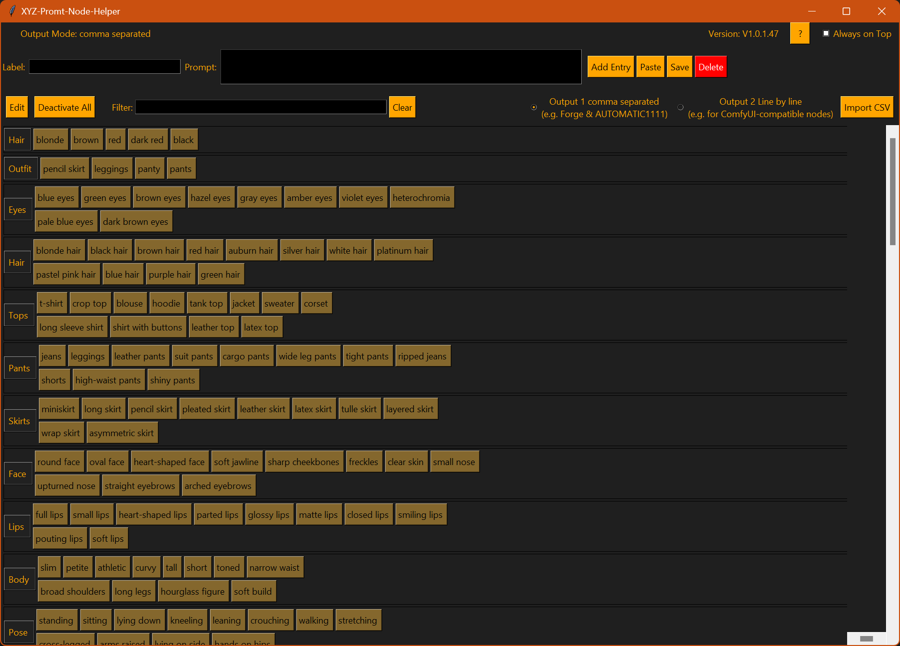
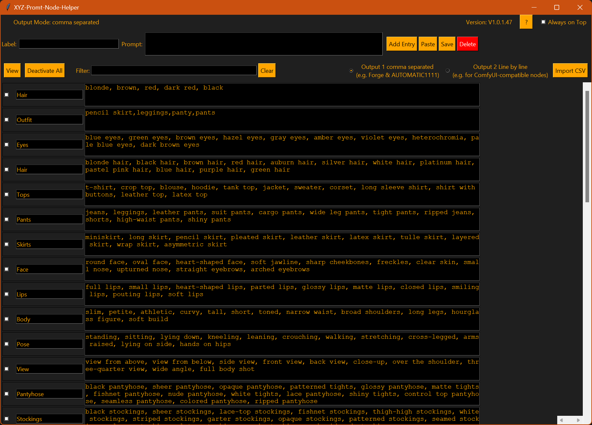
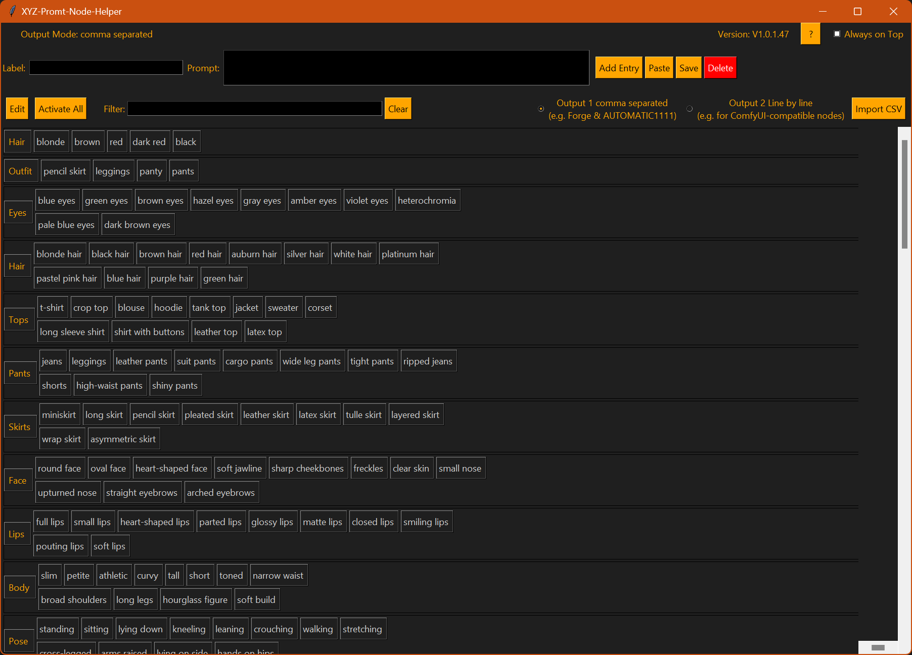
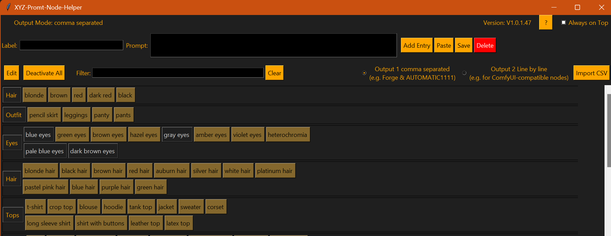
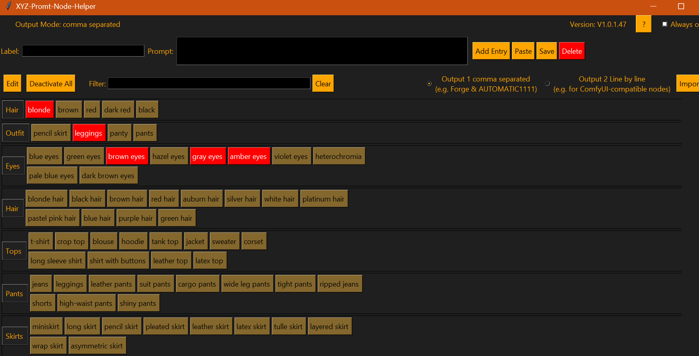

# XYZ-Promt-Node-Helper 🧠  
**Version: v1.0.0.46**

The **XYZ-Promt-Node-Helper** is a powerful prompt management tool for AI image generation workflows.  
It helps you structure, edit, and export prompt components for use in tools like **Forge**, **AUTOMATIC1111**, or **ComfyUI**.

---

## 📖 What does this tool do?

This application is a GUI-based utility to:

- Manage named collections of prompt values.
- Split prompts into individually togglable buttons.
- Copy full or partial prompts with a click.
- Import prompt data from CSV.
- Switch between view/edit modes.
- Automatically back up your prompt list whenever changes are made.

It simplifies the creation of clean, reusable prompt templates and allows you to quickly copy specific prompt parts depending on your current use case.

---

## 🧩 Features – In Detail

## 🧰 Included Prompt Templates

This tool comes with a ready-to-use prompt list (`XYZ-Promt-Node-Helper.json`) to demonstrate its features.

If you want to start with a clean slate:
> Just delete the file and launch the tool again.  
> The app will generate an empty list automatically.

### ➕ Add Entries
- You can define **named prompt templates**, each consisting of comma-separated prompt fragments (e.g., adjectives, styles, lighting).
- Use the top input fields to create a new entry: 
  - Enter a **Label** (e.g. `Portrait_Lighting`) and the corresponding **Prompt** values.
  - Click **“Add”** to insert it into the list.

### ✏️ Edit Entries
- Switch to **Edit Mode** using the `Edit` button.
- In this mode, entries can be edited directly using text fields.
- Save your changes with the **“Save”** button (which also creates a backup).

### 🗑️ Delete Entries or Parts
- In **View Mode**, double-click:
  - A **label** to mark the full entry for deletion.
  - A **prompt button** to mark individual values for deletion.
- Confirm deletion using the **“Delete”** button.
- In **Edit Mode**, select entries using checkboxes and remove them with “Save”.

### 📋 Copying Prompts
- **Single-click a label** to copy the prompt to clipboard.
- Only **active values** (not deactivated or marked for deletion) are included.
- **Long-press** (hold for ~2 seconds) a value to copy that single part.

### 🔃 Toggle Mode
- Switch between:
  - **View Mode** (buttons & interactions),
  - **Edit Mode** (text-based editing).

### 📤 Output Format
- Select between:
  - **Comma separated** (`value1, value2, value3`) for Forge, AUTOMATIC1111, etc.
  - **Line by line** (one value per line) for ComfyUI nodes.
- Affects how copied prompt data is formatted.

### 🔍 Filter & Search
- Use the **Filter Field** to live-search through your entries.
- Multiple terms (comma-separated) are supported using OR logic.
- Matching entries/values are highlighted.

### 📥 CSV Import - BETA
- Click **“Import CSV”** to load multiple prompt entries from a file.
- Format:  
  ```
  Label, value1, value2, value3, ...
  ```
- Duplicates are skipped during import.

### ✅ Toggle All Buttons
- Quickly activate or deactivate **all prompt buttons** with one click.
- Useful when you want to test combinations or isolate specific tags.

---

## 💾 Data File & Automatic Backups

- All prompt data is stored locally in:
  ```
  ./XYZ-Promt-Node-Helper.json
  ```

- Every time you **save** or **delete** entries, the app creates an **automatic backup** of this file:
  ```
  ./backup-XYZ-Promt-Node-Helper/
  ```

- The backup files are named based on the current timestamp (e.g. `XYZ-Promt-Node-Helper.json-2025-04-06-17-05-22`).

- The cleanup system works like this:
  - The backup folder is sorted by last modified time.
  - Starting from the **11th oldest file**, each is checked:
    - If the file is **older than 30 days**, it is deleted.
  - This ensures that only the **10 most recent** backups are always preserved, and older ones are removed over time.

This keeps your storage clean without losing recent work history.

---

## 🖼️ Screenshots

### 🔎 Prompt Overview (View Mode)


### 🛠️ Editable List


### 🛠️ one click to toggle between all deactivated (will not be copied)and all activated, will be copied as well


### 🛠️ click once, value is deactivated (not copied)
hold for 2 seconds Only the value is copied to the clipboard


### 🛠️ Double-click on value or line - marked for deletion


---

## 📦 Requirements

- Python 3.7+
- Required library:
  ```bash
  pip install pyperclip
  ```

---

## 🚀 How to Start

```bash
python XYZ-Promt-Node-Helper.py
```

---

## 📃 License

This project is licensed under the **Creative Commons Attribution-NonCommercial 4.0 International (CC BY-NC 4.0)** license.  
That means: **you may use and modify this project freely as long as you credit the author and do not use it commercially.**

© 2025 by LordKa-Berlin

---

## 🛠️ Development

This is an actively developed project.  
Feedback, feature requests, and pull requests are welcome!

GitHub Repository: [https://github.com/LordKa-Berlin](https://github.com/LordKa-Berlin)
