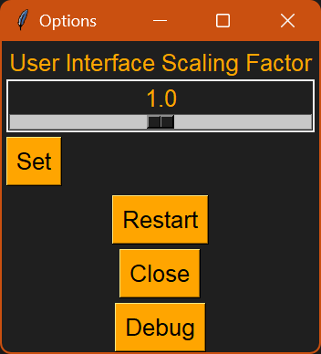

# XYZ-Promt-Node-Helper 🧠  
**Version: v1.0.0.46**

The **XYZ-Promt-Node-Helper** is a powerful prompt management tool for AI image generation workflows.  
It helps you structure, edit, and export prompt components for use in tools like **Forge**, **AUTOMATIC1111**, or **ComfyUI**.
Supports the creation and management of values for cyclical prompt replacement in tools such as the X/Y/Z Plot script or the PromptReplace Node.  
Perfect for generating systematic image variations.

---

## 🧠 Features

- Manage named collections of prompt values.
- Split prompts into individually toggleable buttons.
- Copy full or partial prompts with a single click.
- Import prompt data from CSV files.
- Switch between display and edit modes.
- Automatically save your prompt list whenever changes are made.

---

## ♻️ Use for Cyclical Prompts and Replacement Systems

This tool is ideal for preparing and managing value sets used in cyclical prompt workflows, such as:

- 🎯 **Script: X/Y/Z Plot** in *Automatic1111*
- 🧩 **PromptReplace Node** in *ComfyUI*
- 📦 Batch or loop features in *InvokeAI*, *SD.Next*, *Forge*, etc.

The generator systematically replaces specific words or placeholders in your prompt (e.g., `"tree"` → `"house"` → `"car"`) to automatically create multiple image variations.

With this tool, you can precisely prepare prompt value sets and copy them into the GUI — structured, flexible, and reusable.

---

## 🧩 Features – In Detail

## 🧰 Included Prompt Templates

This tool comes with a ready-to-use prompt list (`XYZ-Promt-Node-Helper.json`) to demonstrate its features.

If you want to start with a clean slate:
> Just delete the file and launch the tool again.  
> The app will generate an empty list automatically.

### ➕ Add Entries
- You can define **named prompt templates**, each consisting of comma-separated prompt fragments (e.g., adjectives, styles, lighting).
- Use the top input fields to create a new entry: 
  - Enter a **Label** (e.g. `Portrait_Lighting`) and the corresponding **Prompt** values.
  - Click **“Add”** to insert it into the list.

### ✏️ Edit Entries
- Switch to **Edit Mode** using the `Edit` button.
- In this mode, entries can be edited directly using text fields.
- Save your changes with the **“Save”** button (which also creates a backup).

### 🗑️ Delete Entries or Parts
- In **View Mode**, double-click:
  - A **label** to mark the full entry for deletion.
  - A **prompt button** to mark individual values for deletion.
- Confirm deletion using the **“Delete”** button.
- In **Edit Mode**, select entries using checkboxes and remove them with “Save”.

### 📋 Copying Prompts
- **Single-click a label** to copy the prompt to clipboard.
- Only **active values** (not deactivated or marked for deletion) are included.
- **Long-press** (hold for ~2 seconds) a value to copy that single part.

## 🔧 Main Functionalities

### 1. Label Button (Entry Name)

- **Single Click**  
  Copies the associated prompt to the clipboard. Only the *active* values (those not deactivated or marked for deletion) are included.

- **Double Click**  
  Toggles the deletion state for the entire entry:  
  - First double-click: entry is marked for deletion (e.g. red background with white text).  
  - Second double-click: entry is returned to normal active state.

---

### 2. Value Buttons (Prompt Elements)

- **Single Click**  
  Toggles the state of a single prompt element:  
  - **Active (State 0)**: included in copied text.  
  - **Deactivated (State 1)**: visually marked, excluded from copying.

- **Double Click**  
  Toggles deletion mark for a single element:  
  - First double-click marks as deleted (e.g. red).  
  - Second double-click restores to active.

- **Long Press (≈2 seconds)**  
  Copies the individual value directly to the clipboard regardless of its current state.

---

### 🔃 Toggle Mode
- Switch between:
  - **View Mode** (buttons & interactions),
  - **Edit Mode** (text-based editing).

### 📤 Output Format
- Select between:
  - **Comma separated** (`value1, value2, value3`) for Forge, AUTOMATIC1111, etc.
  - **Line by line** (one value per line) for ComfyUI nodes.
- Affects how copied prompt data is formatted.

### 🔍 Filter & Search
- Use the **Filter Field** to live-search through your entries.
- Multiple terms (comma-separated) are supported using OR logic.
- Matching entries/values are highlighted.

### 📥 CSV Import - BETA
- Click **“Import CSV”** to load multiple prompt entries from a file.
- Format:  
  ```
  Label, value1, value2, value3, ...
  ```
- Duplicates are skipped during import.

### ✅ Toggle All Buttons
- Quickly activate or deactivate **all prompt buttons** with one click.
- Useful when you want to test combinations or isolate specific tags.

---

## 💾 Data File & Automatic Backups

- All prompt data is stored locally in:
  ```
  ./XYZ-Promt-Node-Helper.json
  ```

- Every time you **save** or **delete** entries, the app creates an **automatic backup** of this file:
  ```
  ./backup-XYZ-Promt-Node-Helper/
  ```

- The backup files are named based on the current timestamp (e.g. `XYZ-Promt-Node-Helper.json-2025-04-06-17-05-22`).

- The cleanup system works like this:
  - The backup folder is sorted by last modified time.
  - Starting from the **11th oldest file**, each is checked:
    - If the file is **older than 30 days**, it is deleted.
  - This ensures that only the **10 most recent** backups are always preserved, and older ones are removed over time.

This keeps your storage clean without losing recent work history.

---

## 🖼️ Screenshots

### 🔎 Prompt Overview (View Mode)


### 🛠️ Editable List


### 🛠️ one click to toggle between all deactivated (will not be copied)and all activated, will be copied as well


### 🛠️ click once, value is deactivated (not copied)
hold for 2 seconds Only the value is copied to the clipboard


### 🛠️ Double-click on value or line - marked for deletion


## 🧪 Testbild

Hier siehst du das eingebundene Testbild aus dem Ordner `assets`:




---

## 📦 Requirements

- Python 3.7+
- Required library:
  ```bash
  pip install pyperclip
  ```

---

## 🚀 How to Start

```bash
python XYZ-Promt-Node-Helper.py
```

---

## 📃 License

This project is licensed under the **Creative Commons Attribution-NonCommercial 4.0 International (CC BY-NC 4.0)** license.  
That means: **you may use and modify this project freely as long as you credit the author and do not use it commercially.**

© 2025 by LordKa-Berlin

---

## 🛠️ Development

This is an actively developed project.  
Feedback, feature requests, and pull requests are welcome!

GitHub Repository: [https://github.com/LordKa-Berlin](https://github.com/LordKa-Berlin)
